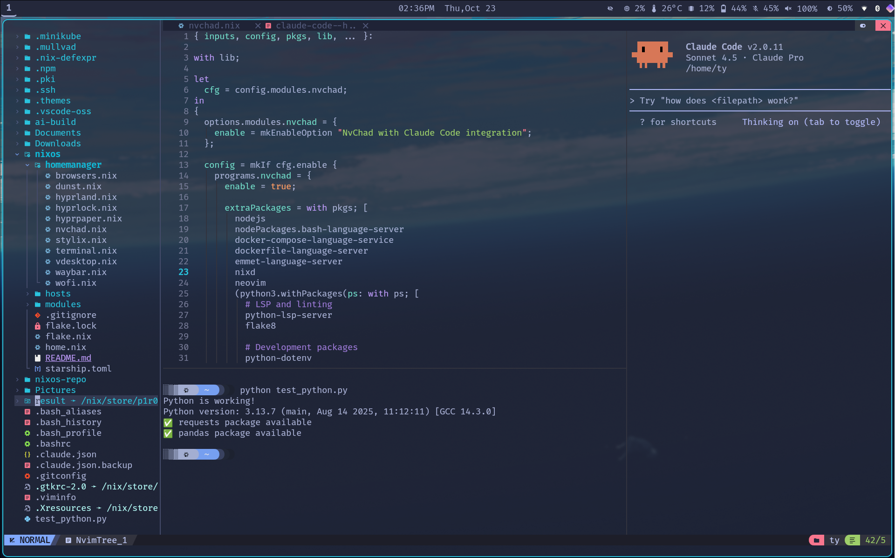

# NixOS Multi-Host Configuration

A beautiful, modular NixOS configuration supporting multiple machines with Hyprland and Niri desktop environments.

## Screenshots

### Hyprland Desktop with Tokyo Night Theme



### Niri Desktop with Development Environment


## What is This?

This is a complete NixOS configuration that uses a **modular approach** to manage your system. Think of it like building blocks - you can enable or disable different features (modules) to customize your system exactly how you want it.

**Perfect for:** Someone who has just installed NixOS minimal and wants a beautiful, functional desktop environment without manually configuring everything from scratch.

## What You Get

- **Two Desktop Options**: Choose between Hyprland (dynamic tiling) or Niri (scrollable tiling)
- **Complete Wayland Setup**: Modern compositor with all the bells and whistles
- **Pre-configured Tools**: Terminal, browsers, file manager, notifications, screenshots, and more
- **System Theming**: Automatic consistent theming with Stylix (Tokyo Night theme)
- **Hardware Support**: Audio, Bluetooth, graphics (Intel/AMD/NVIDIA)
- **Optional Gaming Setup**: Steam, Lutris, MangoHud ready to enable
- **Multi-Machine Support**: Manage multiple computers from one configuration

## Prerequisites

You need to have:
1. Booted into the NixOS minimal installer
2. An active internet connection
3. Your drives partitioned and mounted at `/mnt`

If you haven't partitioned yet, see the [Installation Guide](#installation-guide) below.

---

## Understanding the Modular Structure

This configuration is organized into **two types of modules**:

### 1. System Modules (in `modules/`)

These configure system-level settings that require root privileges. They're imported in your host's `configuration.nix` file.

**Categories:**

#### Hardware Modules (`modules/hardware/`)
Configure hardware-specific features:
- **`audio.nix`** - PipeWire audio system (modern replacement for PulseAudio)
- **`bluetooth.nix`** - Bluetooth support with Blueman manager
- **`integrated-graphics.nix`** - For Intel or AMD integrated graphics
- **`nvidiahybrid.nix`** - NVIDIA + Intel hybrid graphics with PRIME
- **`amd.nix` / `amd-dedicated.nix`** - AMD GPU configurations

#### Desktop Modules (`modules/desktop/`)
Desktop environment components:
- **`hyprland.nix`** - Hyprland compositor and ecosystem tools
- **`niri.nix`** - Niri scrollable tiling compositor
- **`xdg.nix`** - Desktop portals (file pickers, screen sharing)
- **`thunar.nix`** - File manager with plugins

#### Service Modules (`modules/services/`)
System services and daemons:
- **`networking.nix`** - NetworkManager, VPN support (Tailscale, WireGuard, OpenVPN)
- **`display-manager.nix`** - GDM login screen and input devices
- **`system-services.nix`** - Misc services (Hypridle, firmware updates, etc.)

#### Feature Modules
- **`fonts.nix`** - System fonts (Fira Code Nerd Font, Font Awesome)
- **`security.nix`** - Fingerprint authentication and security hardening
- **`stylix.nix`** - System-wide theming (Tokyo Night theme)
- **`laptoppower.nix`** - Laptop power management (auto-cpufreq)
- **`virtualization.nix`** - VM support (virt-manager, quickemu)
- **`gaming/gaming.nix`** - Gaming setup (Steam, Lutris, MangoHud, Gamemode)

### 2. Home Manager Modules (in `homemanager/`)

These configure user-level applications and settings (your personal environment). They're enabled per-user in your host's `configuration.nix`.

**Available Modules:**

- **`hyprland.nix`** - Hyprland window manager config (keybindings, animations, etc.)
- **`niri.nix`** - Niri window manager config
- **`terminal.nix`** - Kitty terminal configuration
- **`browsers.nix`** - Browser configurations
- **`nvchad.nix`** - NvChad (Neovim) configuration
- **`waybar.nix`** - Status bar
- **`wofi.nix`** - Application launcher
- **`dunst.nix`** - Notification daemon
- **`hyprlock.nix`** - Screen locker
- **`hyprpaper.nix`** - Wallpaper daemon
- **`swaylock.nix`** - Alternative screen locker
- **`swayidle.nix`** - Idle management
- **`alacritty.nix`** - Alternative terminal emulator
- **`btop.nix`** - System monitor
- **`stylix.nix`** - User-level theming
- **`desktop-apps.nix`** - Desktop applications
- **`element.nix`** - Element (Matrix client)
- **`vdesktop.nix`** - Virtual desktop configuration

---

## How Modules Work

### System Modules
System modules are **imported** in your `configuration.nix`. When imported, they're active.

```nix
imports = [
  ../../modules/hardware/audio.nix          # ✓ Enabled
  ../../modules/hardware/bluetooth.nix      # ✓ Enabled
  # ../../modules/gaming/gaming.nix        # ✗ Disabled (commented out)
];
```

To disable a system module: comment it out or remove the import line.

### Home Manager Modules
Home Manager modules use an **enable/disable** pattern. They're always imported in `home.nix`, but you control them in your host's `configuration.nix`:

```nix
home-manager.users.ty = {
  imports = [ ../../home.nix ];
  config.modules = {
    # Desktop environment choice
    hyprland.enable = true;   # ✓ Using Hyprland
    niri.enable = false;      # ✗ Not using Niri

    # Applications
    terminal.enable = true;   # ✓ Enabled
    browsers.enable = true;   # ✓ Enabled
  };
};
```

**The beauty of this system:** All modules are defined in one place, but each computer (host) can enable exactly what it needs.

---

## Installation Guide

### Step 1: Partition Your Drive

This example uses a single NVMe drive (`/dev/nvme0n1`). Adjust for your hardware.

**Warning:** This erases all data on the drive!

```bash
# Open partitioning tool
gdisk /dev/nvme0n1

# Create:
# 1. 512MB EFI partition (type EF00)
# 2. Remaining space for root (type 8300)
```

**Format and mount:**
```bash
# Format partitions
mkfs.fat -F 32 /dev/nvme0n1p1
mkfs.ext4 /dev/nvme0n1p2

# Mount root
mount /dev/nvme0n1p2 /mnt

# Mount boot
mkdir -p /mnt/boot
mount /dev/nvme0n1p1 /mnt/boot
```

### Step 2: Clone This Repository

```bash
# Install git
nix-shell -p git

# Clone to /mnt/etc/nixos
git clone https://github.com/TyF1ghter/nixos.git /mnt/etc/nixos

# Navigate into it
cd /mnt/etc/nixos
```

### Step 3: Create Your Host Configuration

Copy the template to create your machine's configuration:

```bash
# Replace YOUR_HOSTNAME with your desired hostname (e.g., "laptop", "desktop", etc.)
cp -r hosts/template hosts/YOUR_HOSTNAME
```

### Step 4: Generate Hardware Configuration

Let NixOS detect your hardware:

```bash
nixos-generate-config --show-hardware-config > hosts/YOUR_HOSTNAME/hardware-configuration.nix
```

### Step 5: Customize Your Configuration

Edit your host's configuration file:

```bash
nano hosts/YOUR_HOSTNAME/configuration.nix
```

**Required changes:**

1. **Line 55** - Set your hostname:
   ```nix
   networking.hostName = "YOUR_HOSTNAME";  # Change this
   ```

2. **Line 63** - Set your timezone:
   ```nix
   time.timeZone = "America/New_York";  # Change to your timezone
   ```

3. **Lines 103-108** - Set your username:
   ```nix
   users.users.ty = {  # Change "ty" to your username
     isNormalUser = true;
     description = "Your Name";  # Change this
     extraGroups = [ "networkmanager" "wheel" ];
   };
   ```

4. **Line 111** - Update home-manager username:
   ```nix
   home-manager.users.ty = {  # Change "ty" to match your username above
   ```

**Optional changes:**

- **Graphics**: Choose between integrated or NVIDIA hybrid graphics (lines 18-24)
- **Gaming**: Uncomment line 42 if you want Steam and gaming tools
- **Laptop**: Uncomment line 46 for laptop power management
- **Desktop Environment**: Choose Hyprland or Niri (lines 118-123)

### Step 6: Add Host to Flake

Edit `flake.nix` to add your new host:

```bash
nano flake.nix
```

Add your configuration to `nixosConfigurations` (around line 104):

```nix
nixosConfigurations = {
  # ... existing hosts ...

  YOUR_HOSTNAME = nixpkgs.lib.nixosSystem {
    specialArgs = { inherit inputs; username = "ty"; };  # Use your username
    system = "x86_64-linux";
    modules = [
      ./hosts/YOUR_HOSTNAME/configuration.nix
      inputs.stylix.nixosModules.stylix
      inputs.home-manager.nixosModules.home-manager
      {
        home-manager.useGlobalPkgs = true;
        home-manager.useUserPackages = true;
        home-manager.backupFileExtension = "hm-backup";
      }
    ];
  };
};
```

### Step 7: Install NixOS

Run the installer:

```bash
nixos-install --flake .#YOUR_HOSTNAME
```

This will:
- Download all packages
- Build your system
- Install everything to `/mnt`

**Note:** First-time installation takes 15-30 minutes depending on your internet speed.

When prompted, set your user password.

### Step 8: Reboot

```bash
reboot
```

Remove the installation media and boot into your new NixOS system!

---

## Post-Installation

### First Boot

You'll be greeted by GDM (login screen). Log in with your username and password.

Choose your desktop environment:
- **Hyprland** - Dynamic tiling with beautiful animations
- **Niri** - Scrollable tiling with DankMaterialShell

### Making Changes

After installation, your configuration lives in `/etc/nixos`.

**To modify your system:**

1. Edit files in `/etc/nixos/hosts/YOUR_HOSTNAME/`
2. Rebuild your system:
   ```bash
   sudo nixos-rebuild switch --flake /etc/nixos#YOUR_HOSTNAME
   ```

**Pro tip:** The template includes helpful aliases in your shell:
- `updoot` - Rebuild system with your hostname
- `nixconf` - Edit your configuration.nix
- `homeconf` - Edit home.nix
- `flakeconf` - Edit flake.nix

### Enabling/Disabling Modules

**To enable gaming support:**

Edit `hosts/YOUR_HOSTNAME/configuration.nix`, uncomment:
```nix
../../modules/gaming/gaming.nix
```

Then run `updoot` or `sudo nixos-rebuild switch --flake /etc/nixos#YOUR_HOSTNAME`.

**To switch from Hyprland to Niri:**

Edit `hosts/YOUR_HOSTNAME/configuration.nix`, change:
```nix
config.modules = {
  hyprland.enable = false;  # Disable Hyprland
  niri.enable = true;       # Enable Niri
};
```

Then rebuild.

### Using Fingerprint Authentication (if available)

If your laptop has a fingerprint reader:

1. Enroll your fingerprints:
   ```bash
   fprintd-enroll
   ```

2. Follow the prompts to scan your finger multiple times

3. Now you can use your fingerprint for:
   - Login (GDM)
   - Sudo commands
   - Screen lock (Hyprlock)

### Updating Your System

Update packages:
```bash
nix flake update /etc/nixos
sudo nixos-rebuild switch --flake /etc/nixos#YOUR_HOSTNAME
```

---

## Key Bindings (Hyprland)

The main modifier key is `SUPER` (Windows key).

### Applications
- `SUPER + Q` - Terminal
- `SUPER + E` - File manager (Thunar)
- `SUPER + F` - Brave browser
- `SUPER + B` - LibreWolf browser
- `SUPER + SPACE` - App launcher (Wofi)
- `SUPER + L` - Lock screen
- `SUPER + K` - Close window
- `SUPER + M` - Exit Hyprland
- `SUPER + SHIFT + S` - Screenshot region

### Window Management
- `SUPER + V` - Toggle floating
- `SUPER + J` - Toggle split
- `SUPER + SHIFT + F` - Fullscreen
- `SUPER + Arrow Keys` - Move focus
- `SUPER + 1-9` - Switch workspace
- `SUPER + SHIFT + 1-9` - Move window to workspace

### Media Keys
- Volume up/down/mute
- Brightness up/down
- Media play/pause/next/previous

Full configuration in `homemanager/hyprland.nix`.

---

## Managing Multiple Computers

The power of this configuration is managing multiple machines from one repository.

**Example:** You have a desktop and a laptop.

**Desktop (`hosts/desktop/configuration.nix`):**
```nix
imports = [
  ../../modules/hardware/amd-dedicated.nix  # Desktop GPU
  ../../modules/gaming/gaming.nix          # Gaming PC
  # No laptoppower.nix - it's a desktop
];
```

**Laptop (`hosts/laptop/configuration.nix`):**
```nix
imports = [
  ../../modules/hardware/integrated-graphics.nix  # Just integrated GPU
  ../../modules/laptoppower.nix                   # Battery management
  # No gaming module - you don't game on laptop
];
```

Both share the same base modules (audio, networking, fonts, etc.) but enable only what they need.

---

## Troubleshooting

### Screen is blank after installation
Your monitor configuration may need adjustment. Edit `homemanager/hyprland.nix` line 14:
```nix
monitor = "desc:YourMonitorModel,1920x1080@60,0x0,1";
```

Find your monitor info with:
```bash
hyprctl monitors
```

### NVIDIA graphics not working
1. Check PCI bus IDs in `modules/hardware/nvidiahybrid.nix`
2. Find your IDs:
   ```bash
   lspci | grep -E "VGA|3D"
   ```
3. Update the module with correct bus IDs

### Audio not working
Ensure PipeWire is running:
```bash
systemctl --user status pipewire
```

### Can't connect to WiFi
Open terminal and use nmtui:
```bash
nmtui
```

Or from the waybar network icon.

---

## Customization

### Change Theme

Edit `modules/stylix.nix` to change the system theme. Stylix supports many base16 themes.

### Change Wallpaper

Wallpapers are in `/home/ty/nixos-repo/walls/`.

To add your own:
1. Copy images to `walls/`
2. Edit `homemanager/hyprpaper.nix` to reference your wallpaper

### Add System Packages

Edit `hosts/YOUR_HOSTNAME/configuration.nix`, add packages to `environment.systemPackages`:
```nix
environment.systemPackages = with pkgs; [
  # ... existing packages ...
  firefox  # Add Firefox
  gimp     # Add GIMP
];
```

Then rebuild.

---

## File Structure

```
nixos-repo/
├── flake.nix              # Main entry point, defines all hosts
├── flake.lock             # Locked dependency versions
├── home.nix               # Global home-manager configuration
├── hosts/                 # Per-machine configurations
│   ├── 9310/              # Example: Dell XPS 9310
│   ├── xps9520/           # Example: Dell XPS 9520
│   ├── mika/              # Example: Desktop
│   ├── zeph14/            # Example: Laptop
│   └── template/          # Template for new hosts
├── modules/               # System-level modules
│   ├── hardware/          # Hardware configuration
│   ├── desktop/           # Desktop environments
│   ├── services/          # System services
│   └── gaming/            # Gaming setup
├── homemanager/           # User-level modules
├── walls/                 # Wallpapers
├── screenshot1.png        # Desktop screenshot
└── screenshot2.png        # Desktop screenshot
```

---

## Contributing

Found a bug or want to add a feature? Feel free to open an issue or PR on GitHub!

## Credits

- **NixOS** - The purely functional Linux distribution
- **Hyprland** - Dynamic tiling Wayland compositor
- **Niri** - Scrollable tiling Wayland compositor
- **Stylix** - System-wide theming
- **Home Manager** - Dotfile management for Nix
- **Tokyo Night** - Beautiful color scheme

---

## License

MIT License - See LICENSE file for details.

---

## Need Help?

- **NixOS Manual**: https://nixos.org/manual/nixos/stable/
- **Hyprland Wiki**: https://wiki.hyprland.org/
- **Home Manager Manual**: https://nix-community.github.io/home-manager/
- **This repo's issues**: https://github.com/TyF1ghter/nixos/issues

Welcome to NixOS! Enjoy your reproducible, declarative system configuration.
